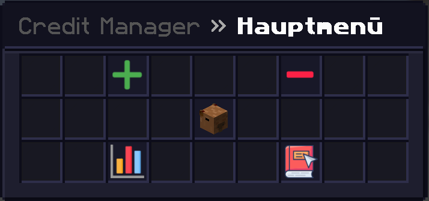
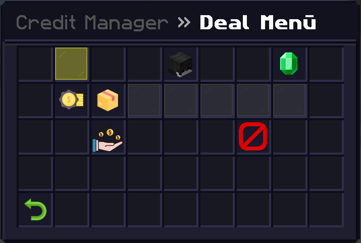
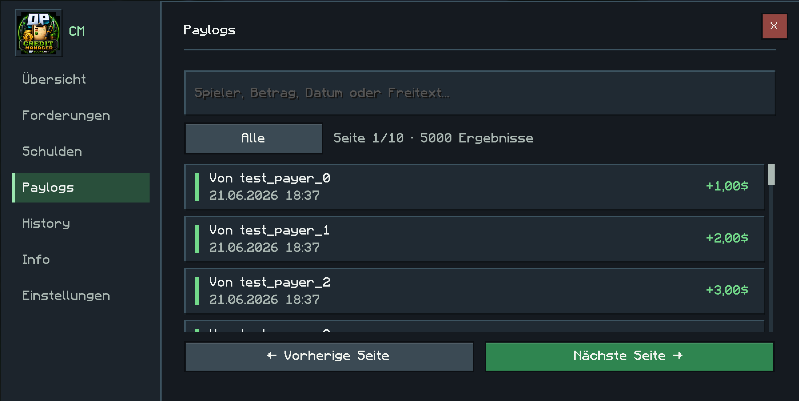

# CreditManager

CreditManager ist eine clientseitige Fabric-Mod für Minecraft **1.21.11**. Sie dokumentiert Forderungen, Schulden, Geld- und Item-Zahlungen sowie erkannte Paylogs lokal auf deinem Rechner.

**Version:** `1.1.3-beta` · **Java:** `21` · **Minecraft:** `1.21.11`

## Bedienung

Öffne die GUI mit:

```text
/cm
/CreditManager
/OpCreditManager
```

Dort lassen sich Deals, Zahlungen, Paylogs, Statistiken und Einstellungen verwalten.

## Funktionen

- Forderungen und Schulden mit Betrag, Fälligkeit, Bezeichnung und Notiz
- Geld- und Item-Zahlungen mit Detail- und Item-Ansicht
- Automatische Paylog-Erkennung, Suche und 500er-Paginierung
- Deal-History für bezahlte, stornierte und archivierte Deals
- Lokale Statistiken sowie Dark-, Light- und Custom-Themes

## Daten

Alle Daten liegen im Minecraft-Spielordner unter `CreditManagerLogs/`.

- Deals, Zahlungen, Ereignisse und Paylogs werden in der lokalen H2-Datenbank `creditmanager.mv.db` gespeichert.
- Alte JSON-Dateien werden beim Start automatisch und verlustfrei migriert; sie werden danach archiviert, nicht gelöscht.
- H2-Sicherungen werden als validierte ZIP-Archive mit Manifest im Unterordner `backups/` angelegt.
- Kann die aktive Datenbank nicht gelesen werden oder ist sie unerwartet leer, sperrt CreditManager Schreibvorgänge und zeigt die Wiederherstellungsansicht statt einer leeren Normal-GUI.
- Eine Wiederherstellung legt die bisherige Datenbank zuerst unter `recovery/quarantine/` ab; sie wird nicht still gelöscht oder überschrieben.
- Item-Zahlungen sind reine Dokumentation und übertragen keine Items an einen Server.

## Vorschau

### Hauptmenü



### Deal-Ansicht



### Paylogs



## Installation

1. [Fabric Loader](https://fabricmc.net/use/installer/) und passende [Fabric API](https://modrinth.com/mod/fabric-api) installieren.
2. Die CreditManager-`.jar` in den Ordner `mods` legen.
3. Minecraft mit Fabric starten.

## Entwicklung und Release

Die vollständige Build-, Release- und Fabric-Smoke-Test-Checkliste steht in [docs/RELEASE_VALIDATION.md](docs/RELEASE_VALIDATION.md).

## Hinweis und Lizenz

CreditManager ist ein privates, inoffizielles Projekt und steht in keiner offiziellen Verbindung zu OPSUCHT.net, Mojang, Microsoft oder Fabric.

Copyright © 2026 Haragucci / Tilljan. Alle Rechte vorbehalten. Details stehen in [LICENSE](LICENSE).
